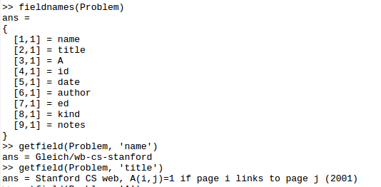
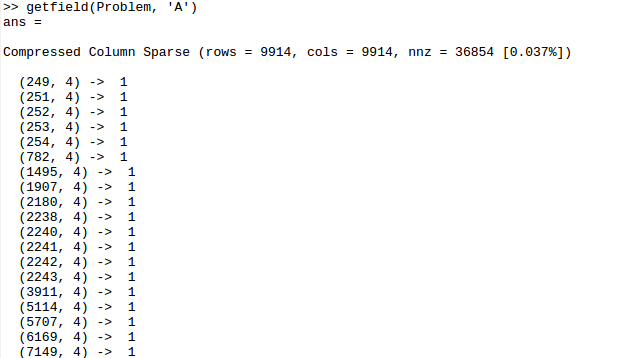
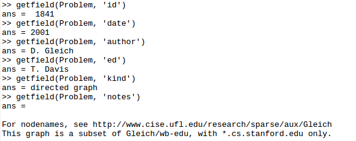

# miniPR

Implement pagerank algorithm for small network.

This is a homework for the short semester cousre "LaTeX and Matlab" at ZJU.

## Assigment

Analyze and discuss the data in wb-cs-stanford.mat

## View data

## Note

There is a [brief course note](note_pr.pdf) about PageRank algorithm.

## Report

Discuss the results and computing speed of four methods. Refer to [report](report.pdf) for more details.
